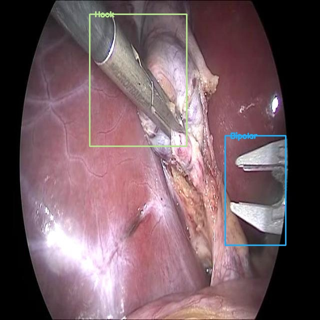

# Surgical-Tool-Detection-using-YOLOv5
1. This deep learning model is built on YOLOv5 architecture which when integrated with formal run-time monitoring methods can act as AI assistant.
2. This AI assistant can be used to generate alert message to surgeons during laparoscopic surgery when any clinical guideline is violated.
3. This model is trained using Cholec80 dataset.
4. Evaluated the model efficiency using object detection spped and confidence score.
5. During laparoscopic surgery, there is high importance for the alert message to be sent without any delay. This model's object detection speed is improved by 81.87 percent than the previously published model using FasterRCNN.

# Output predicted image with 'Bipolar' and 'Hook' as detected objects
 
